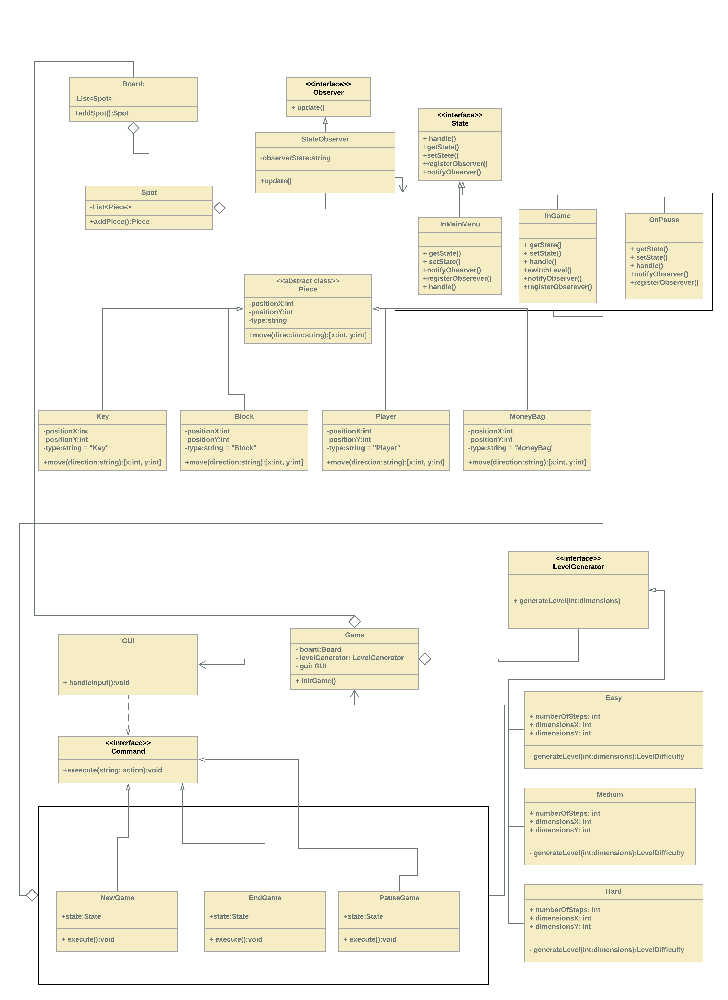

# Club Penguin This Ice Java
 Club Penguin Thin Ice inspired java swing game
 
Design Patterns Final Assignment Start Document

Game Description
The idea is to make a puzzle game which is inspired by the “Thin Ice” minigame in “Club Penguin” (Figure 1 below).  The player is tasked with melting all the ice blocks (light blue) and collecting the key which allows the player to move on to the next level. 

Figure 1. Thin Ice
The player is not allowed to backtrack and once an ice tile has been melted (water tile) it cannot be stepped on again. Some ice blocks cannot be melted immediately (white tile) and some cannot be melted at all (dark blue), therefore, acting as an obstacle to the player.
Design Patterns
The game will use 4 main design patterns: 
Strategy Pattern
The game will use LevelDifficulty interface, which will be implemented by the Easy, Medium, and Hard classes, which will generate a different level layout based on which difficulty the player is playing.
Observer Pattern
The observer pattern is used for observing the state of the game. StateObserver class implements Observer interface and tracks the activity of State classes (subjects), the classes that implement State interface then notify StateObserver for changing the states when necessary with the notifyObserver() function.
Command Pattern
The command pattern is used to handle different commands received from the user input, such as: Move - to move the character in different directions, NewGame, PauseGame and EndGame to choose the game state. Invoker class in this scenario is GUI class, Command is an interface for all commands, and the Receiver is Game class.
State Pattern
The game will use the Game class as Context, and InGame, InMainMenu, and OnPause classes representing different states the game can be in.
The main classes will be:
Board: represents the whole grid
Spot: A spot represents one block of the 12x15 grid and an optional piece.
Piece: The basic building block of the system, every piece will be placed on a spot. Piece class is an abstract class. The extended classes (Key, Block, Player, MoneyBag) implements the abstracted operations.
Game: This class controls the flow of a game. It keeps track of all the game moves and its state.
GUI: This class is responsible for actually rendering the view of the game.
Easy/Medium/Hard: These classes will contain the necessary data and functions for generating easy, medium or hard difficulty levels.
NewGame/EndGame/PauseGame/Move: These classes will act as the different commands that the player has available. 
InMainMenu/InGame/OnPause: These classes are the different states that the game can be in and are related to the previously listed commands.
StateObserver: This class helps to control the different states and will listen for the notifyObserver() function.

Frameworks
The GUI will be made using the GUI capabilities of Java and frameworks such as Java Swing.

Appendix 1
Class diagram

